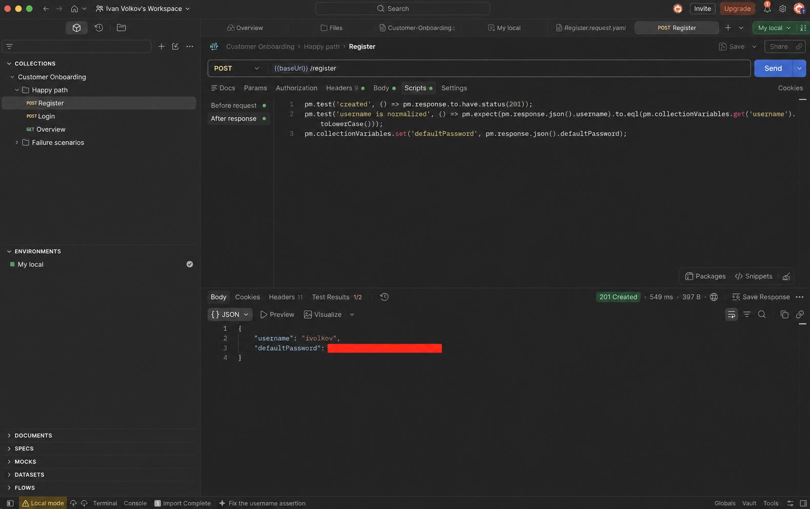
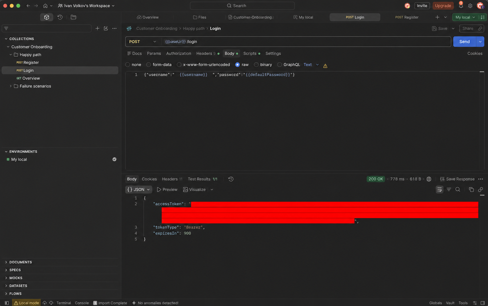
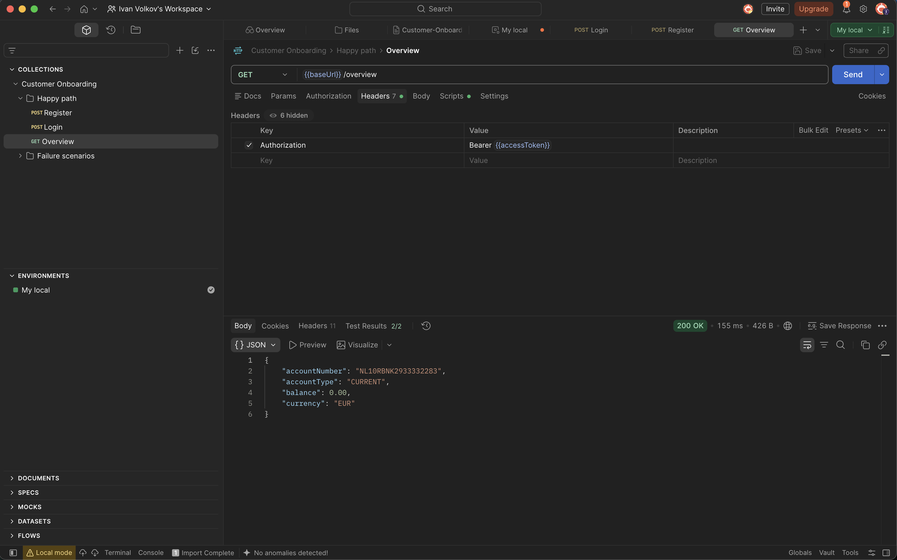
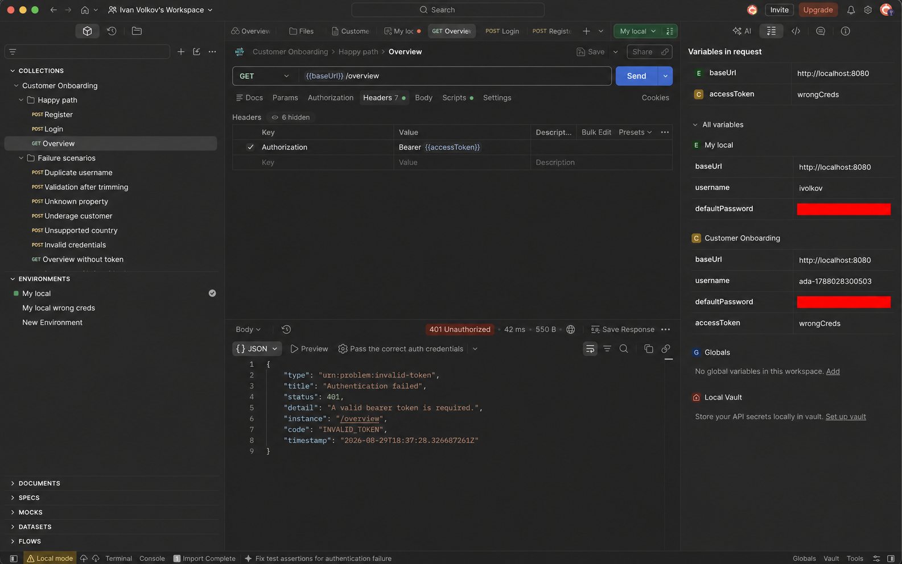
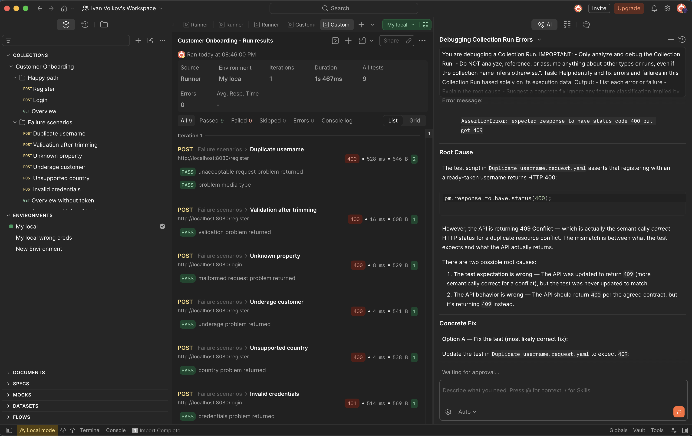

# Customer Onboarding Backend

Java 21/Spring Boot backend with three business endpoints: `POST /register`, `POST /login`, and `GET /overview`.

## Run locally

### Recommended: Docker Compose

Prerequisite: Docker Engine with the Docker Compose v2 plugin. Docker Desktop provides both on macOS and Windows; Docker Engine and the Compose plugin can be installed separately on Linux.

This is the self-contained option: it builds the application image, starts PostgreSQL, applies the database migrations, and exposes the API on port 8080.

```sh
docker compose up --build
```

Open Swagger UI at http://localhost:8080/swagger-ui.html. Stop the stack with `Ctrl-C`; add `-d` to run it in the background.

### Run the tests

The automated suite uses Testcontainers, so start Docker before running:

```sh
./mvnw test
```

Docker Compose enables the `docs` profile for reviewer convenience.

Generate the checked-in OpenAPI artifact from a running docs-profile application:

```sh
curl -fsS http://localhost:8080/v3/api-docs.yaml -o docs/openapi.yaml
```

## Configuration and design

`application.yml` externalizes country eligibility, business clock zone, account details, JWT issuer/secret/lifetime, and the database limiter. `JWT_SECRET_BASE64` is required at startup and must decode to at least 32 bytes.

A global `DatabaseOperationGate` uses Guava's `RateLimiter` to admit at most two database-backed business operations per second for one application replica. It acquires a permit before registration, login, or overview starts persistence work; if capacity is unavailable, the request receives the generic `500 INTERNAL_ERROR` response. Multi-replica coordination is intentionally out of scope.

Registration normalizes usernames to lowercase, accepts NL/BE residences by default, verifies the exact 18th-birthday boundary, creates customer/account in one transaction, stores BCrypt-12 hashes only, and uses iban4j to generate checksum-valid Dutch IBANs. JWT validation is stateless and the overview uses the subject claim only.

Import `postman/Customer-Onboarding.postman_collection.json` to exercise the happy path and contract failure scenarios; it captures the generated password and bearer token automatically.

## Manual validation

The Postman collection was run manually against the local application. The screenshots below show successful registration, login, account overview, invalid-token rejection, and all nine collection assertions passing. The generated password and bearer token are visibly redacted.










